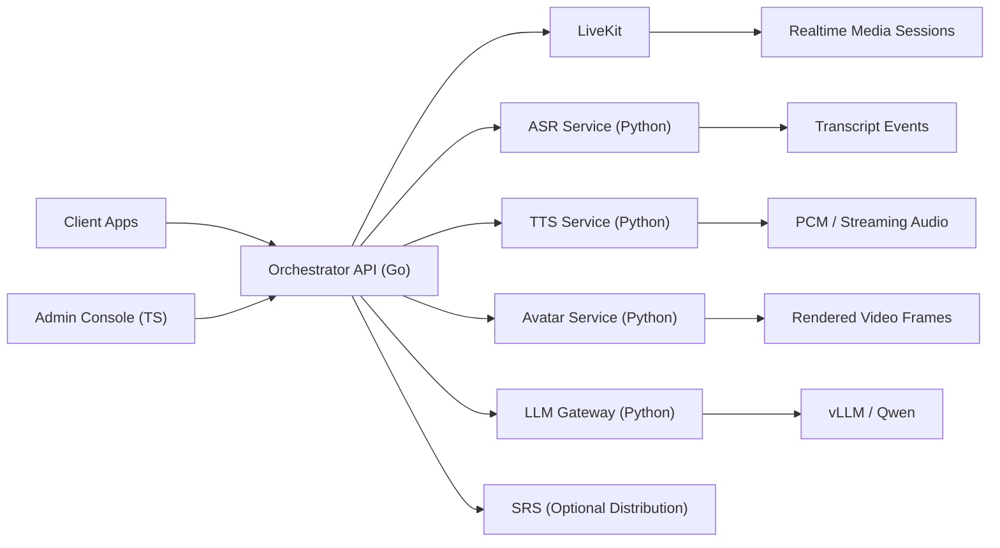

# 架构说明

## 目标

- 优先支持私有化部署
- 尽量采用开源友好的模型栈
- 明确划分服务边界
- 推理后端可替换
- 支持实时语音与数字人交互

## 推荐的长期技术栈

| 层级 | 首选方案 | 说明 |
|---|---|---|
| ASR | SenseVoice | 通过独立 Python 服务承载，便于单独演进 |
| TTS | CosyVoice 2 | 面向流式合成的 TTS 服务边界 |
| 数字人 | MuseTalk | 这一层可移植性最差，必须独立隔离 |
| LLM | Qwen + vLLM | 走 OpenAI 兼容接口路径 |
| RTC | LiveKit | 负责实时房间和音视频传输 |
| 分发 | SRS | 可选的 RTMP/HLS/HTTP-FLV 桥接层 |
| 控制面 | Go | 负责会话、鉴权、策略和编排 |
| 管理后台 | TypeScript | 负责运维、服务状态、会话观察 |

## 系统架构图

## 请求链路

1. 客户端先向编排层申请会话。
2. 编排层创建逻辑会话，并返回媒体与控制接口信息。
3. 音频通过 LiveKit 或直连服务入口进入系统。
4. ASR 服务输出转写结果。
5. 编排层根据策略决定是否调用 LLM。
6. TTS 服务生成语音片段。
7. 数字人服务根据音频或 viseme/timeline 信息进行渲染。
8. 渲染后的媒体重新发布到 LiveKit。
9. 如果需要广播或转封装分发，可额外接入 SRS。

## 设计原则

- 模型服务不承担业务策略。
- Go 编排层不直接承载重型推理。
- 传输协议相关逻辑不进入模型服务内部。
- 每个模型服务都至少暴露 `health`、`info` 和一个明确的推理接口。
- GPU/运行时选择按服务隔离，而不是全局共享。

## 当前阶段范围

- 编排层最小 API
- 模型服务最小契约
- 本地 compose 编排环境
- 服务文档和环境变量约定

## 下一步建议

1. 先把 stub ASR 服务替换成 SenseVoice。
2. 再把 stub TTS 服务替换成 CosyVoice 2。
3. 将 LLM 网关接到 vLLM 托管的 Qwen。
4. 在接入 MuseTalk 之前先把数字人渲染契约定清楚。
5. 把 LiveKit 的房间/会话创建流程接入编排层。
