# AvaStack（元述）项目学习手册

> **面向读者**：新加入项目的研发同学、运维同学，以及希望理解项目全貌的技术决策者。
>
> **手册定位**：从整体到局部，用图文并茂的方式讲解项目架构、模块职责、数据流向、初始化流程、核心业务流程、类图、时序图、设计模式与潜在架构问题。不关注代码风格与语法细节。

---

## 目录

1. [项目概览](#1-项目概览)
2. [整体架构](#2-整体架构)
3. [模块职责](#3-模块职责)
4. [模块依赖关系](#4-模块依赖关系)
5. [数据流向](#5-数据流向)
6. [部署拓扑](#6-部署拓扑)
7. [初始化流程](#7-初始化流程)
8. [核心业务流程](#8-核心业务流程)
9. [核心类图](#9-核心类图)
10. [核心时序图](#10-核心时序图)
11. [设计模式](#11-设计模式)
12. [潜在架构问题与改进建议](#12-潜在架构问题与改进建议)
13. [项目演进路线](#13-项目演进路线)
14. [附录：术语表](#14-附录术语表)

---

## 1. 项目概览

AvaStack（元述）是一个面向**长期私有化部署**的数字人平台能力底座。当前仓库处于架构骨架阶段——服务边界已明确、部署链路已打通、核心接口已定型，但底层模型能力仍以 stub（占位实现）为主，尚未接入真实 AI 模型。

### 1.1 技术栈速览

| 层级 | 技术 | 职责 |
|------|------|------|
| **控制面** | Go 1.22 + 标准库（纯 stdlib，零第三方依赖） | 会话编排、服务路由、健康聚合 |
| **模型服务** | Python 3.11 + FastAPI + Pydantic | ASR / TTS / LLM / Avatar 服务边界 |
| **管理后台** | TypeScript + Vite（原生 DOM，无框架） | 运维面板、会话观察、服务状态 |
| **实时通信** | LiveKit (WebRTC) | 数字人实时音视频传输 |
| **流媒体** | SRS v6 | RTMP/HLS/WebRTC 分发 |
| **LLM 推理** | vLLM（计划中） | 自托管大模型推理 |
| **容器化** | Docker Compose | 本地开发环境编排 7 个服务 |

### 1.2 当前阶段定位

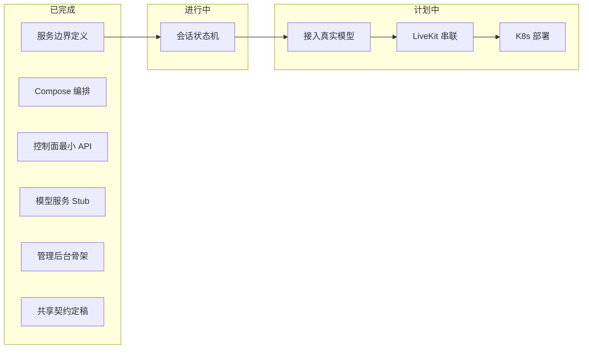
```mermaid
flowchart LR
    subgraph 已完成
        A[服务边界定义]
        B[Compose 编排]
        C[控制面最小 API]
        D[模型服务 Stub]
        E[管理后台骨架]
        F[共享契约定稿]
    end
    subgraph 进行中
        G[会话状态机]
    end
    subgraph 计划中
        H[接入真实模型]
        I[LiveKit 串联]
        J[K8s 部署]
    end
    A --> G
    G --> H
    H --> I
    I --> J
```

---

## 2. 整体架构

### 2.1 分层架构图

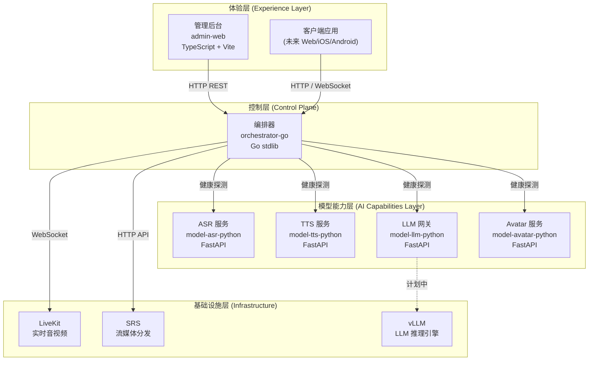
```mermaid
flowchart TB
    subgraph 体验层["体验层 (Experience Layer)"]
        ADMIN["管理后台<br/>admin-web<br/>TypeScript + Vite"]
        CLIENT["客户端应用<br/>(未来 Web/iOS/Android)"]
    end

    subgraph 控制层["控制层 (Control Plane)"]
        ORCH["编排器<br/>orchestrator-go<br/>Go stdlib"]
    end

    subgraph 能力层["模型能力层 (AI Capabilities Layer)"]
        ASR["ASR 服务<br/>model-asr-python<br/>FastAPI"]
        TTS["TTS 服务<br/>model-tts-python<br/>FastAPI"]
        LLM["LLM 网关<br/>model-llm-python<br/>FastAPI"]
        AVATAR["Avatar 服务<br/>model-avatar-python<br/>FastAPI"]
    end

    subgraph 基础设施层["基础设施层 (Infrastructure)"]
        LK["LiveKit<br/>实时音视频"]
        SRS["SRS<br/>流媒体分发"]
        VLLM["vLLM<br/>LLM 推理引擎"]
    end

    ADMIN -->|"HTTP REST"| ORCH
    CLIENT -->|"HTTP / WebSocket"| ORCH
    ORCH -->|"健康探测"| ASR
    ORCH -->|"健康探测"| TTS
    ORCH -->|"健康探测"| LLM
    ORCH -->|"健康探测"| AVATAR
    ORCH -->|"WebSocket"| LK
    ORCH -->|"HTTP API"| SRS
    LLM -.->|"计划中"| VLLM
```

### 2.2 仓库目录结构

```text
AvaStack/
├── docs/                          # 项目文档
│   ├── architecture.md            # 架构说明
│   ├── service-decomposition.md   # 服务拆分说明
│   ├── roadmap.md                 # 技术演进路线
│   ├── tech-stack-overview.md     # 技术栈概览
│   ├── learning-roadmap.md        # 学习路线图
│   └── learning-roadmap.html     # 学习路线图（HTML 版）
├── services/                      # 所有服务代码
│   ├── orchestrator-go/           # Go 编排层
│   │   ├── cmd/api/main.go        # 进程入口
│   │   ├── internal/
│   │   │   ├── config/config.go   # 配置加载
│   │   │   ├── controlplane/      # 控制面核心逻辑
│   │   │   │   ├── types.go       # 领域模型定义
│   │   │   │   ├── store.go       # 会话存储
│   │   │   │   ├── services.go    # 服务注册与健康检查
│   │   │   │   └── status.go      # 状态机
│   │   │   └── httpapi/router.go  # HTTP 路由
│   │   ├── Dockerfile
│   │   └── go.mod
│   ├── model-asr-python/          # ASR 服务
│   ├── model-tts-python/          # TTS 服务
│   ├── model-llm-python/          # LLM 网关
│   ├── model-avatar-python/       # Avatar 渲染服务
│   └── admin-web/                 # 管理后台
├── infra/                         # 基础设施配置
│   ├── livekit/livekit.yaml       # LiveKit 配置
│   ├── srs/srs.conf               # SRS 配置
│   └── vllm/README.md             # vLLM 部署说明
├── shared/                        # 共享资源
│   └── contracts/README.md        # API 契约定义
├── compose.yaml                   # Docker Compose 编排
├── .env.example                   # 环境变量模板
├── start.ps1                      # Windows 启动脚本
├── start-linux.sh                 # Linux 启动脚本
├── start-macos.sh                 # macOS 启动脚本
└── start-unix-common.sh           # Unix 通用启动逻辑
```

---

## 3. 模块职责

### 3.1 avastack-orchestrator（Go 编排层）

```
职责：
✅ 会话生命周期管理（创建 / 查询 / 更新 / 状态流转）
✅ 策略决策（未来扩展）
✅ 服务路由（未来扩展）
✅ 全局健康状态聚合
✅ 面向运维/业务的 API
✅ CORS 支持

不负责：
❌ 语音识别推理
❌ 语音合成推理
❌ 数字人渲染
❌ 任何 GPU 绑定的模型执行
```

### 3.2 四个 Python 模型服务

| 服务 | 容器内端口 | 宿主机端口 | 核心接口 | 计划后端 |
|------|-----------|-----------|----------|----------|
| `model-asr-python` | 8101 | 58101 | `POST /v1/transcribe` | SenseVoice |
| `model-tts-python` | 8102 | 58102 | `POST /v1/synthesize`, `GET /v1/voices` | CosyVoice 2 |
| `model-llm-python` | 8104 | 58104 | `POST /v1/chat` | Qwen + vLLM |
| `model-avatar-python` | 8103 | 58103 | `POST /v1/render` | MuseTalk |

每个模型服务的统一契约：
- `GET /healthz` — 存活探针
- `GET /v1/info` — 服务元信息与计划后端

### 3.3 avastack-admin（管理后台）

```
职责：
✅ 展示下游服务健康概览
✅ 展示当前会话列表
✅ 系统说明展示
✅ 为后续运维面板提供骨架

技术特点：
• 无 React / Vue 框架，纯 TypeScript + DOM 操作
• 通过 fetch() 直接调用编排层 API
• Vite 负责开发服务器与构建
```

### 3.4 基础设施层

| 组件 | 用途 |
|------|------|
| **LiveKit** | WebRTC 实时音视频传输，房间管理，信令服务 |
| **SRS** | RTMP/HLS/WebRTC 流媒体分发，适合直播场景 |
| **vLLM** | 自托管 LLM 推理引擎，OpenAI 兼容接口（计划中） |

---

## 4. 模块依赖关系

### 4.1 编译期依赖

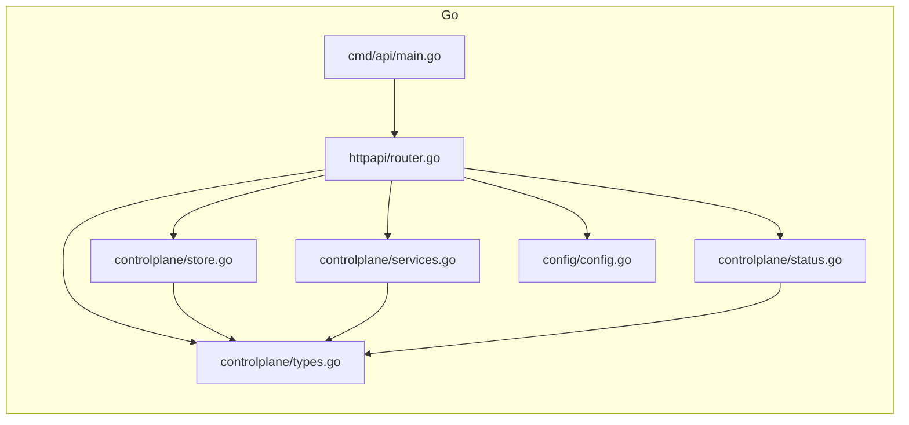
```mermaid
flowchart LR
    subgraph Go
        MAIN["cmd/api/main.go"] --> ROUTER["httpapi/router.go"]
        ROUTER --> STORE["controlplane/store.go"]
        ROUTER --> REGISTRY["controlplane/services.go"]
        ROUTER --> STATUS["controlplane/status.go"]
        ROUTER --> TYPES["controlplane/types.go"]
        ROUTER --> CONFIG["config/config.go"]
        STORE --> TYPES
        REGISTRY --> TYPES
        STATUS --> TYPES
    end
```

**关键特征**：Go 编排层 **完全依赖标准库**，`go.mod` 中没有任何第三方依赖。这保证了极简的构建产物和零供应链风险。

### 4.2 运行时依赖

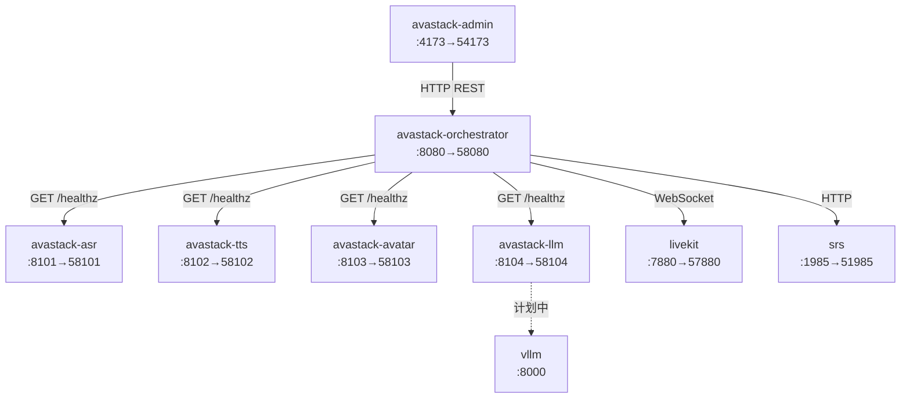
```mermaid
flowchart TB
    ADMIN["avastack-admin<br/>:4173→54173"] -->|"HTTP REST"| ORCH["avastack-orchestrator<br/>:8080→58080"]

    ORCH -->|"GET /healthz"| ASR["avastack-asr<br/>:8101→58101"]
    ORCH -->|"GET /healthz"| TTS["avastack-tts<br/>:8102→58102"]
    ORCH -->|"GET /healthz"| AVATAR["avastack-avatar<br/>:8103→58103"]
    ORCH -->|"GET /healthz"| LLM["avastack-llm<br/>:8104→58104"]

    ORCH -->|"WebSocket"| LK["livekit<br/>:7880→57880"]
    ORCH -->|"HTTP"| SRS["srs<br/>:1985→51985"]

    LLM -.->|"计划中"| VLLM["vllm<br/>:8000"]
```

### 4.3 依赖方向原则

```
体验层 ──→ 控制层 ──→ 能力层
                  ──→ 基础设施层

能力层 ──→ 基础设施层（仅 LLM → vLLM）
```

**核心规则**：
- 下层绝不对上层产生编译期或运行期依赖
- 控制层不依赖任何特定模型实现
- 能力层各服务之间互不调用，完全解耦

---

## 5. 数据流向

### 5.1 目标数据流（完整数字人交互链路）

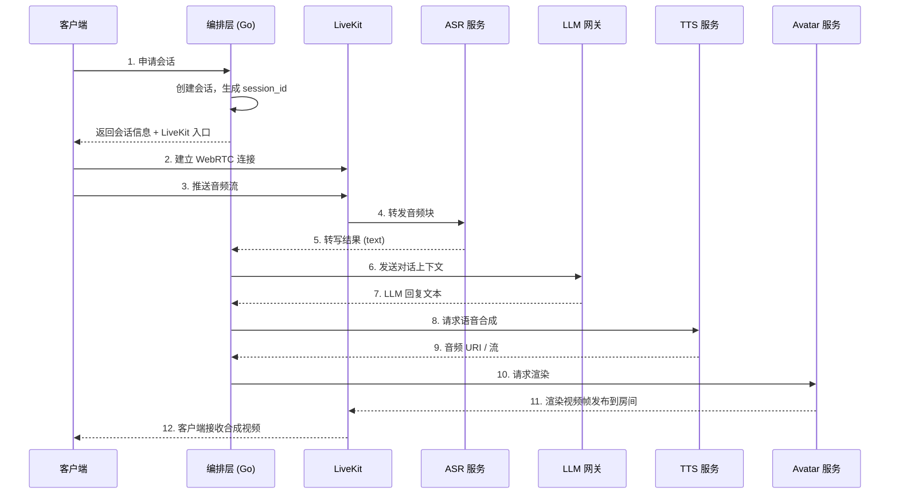
```mermaid
sequenceDiagram
    participant C as 客户端
    participant O as 编排层 (Go)
    participant LK as LiveKit
    participant ASR as ASR 服务
    participant LLM as LLM 网关
    participant TTS as TTS 服务
    participant AV as Avatar 服务

    C->>O: 1. 申请会话
    O->>O: 创建会话，生成 session_id
    O-->>C: 返回会话信息 + LiveKit 入口

    C->>LK: 2. 建立 WebRTC 连接
    C->>LK: 3. 推送音频流

    LK->>ASR: 4. 转发音频块
    ASR-->>O: 5. 转写结果 (text)

    O->>LLM: 6. 发送对话上下文
    LLM-->>O: 7. LLM 回复文本

    O->>TTS: 8. 请求语音合成
    TTS-->>O: 9. 音频 URI / 流

    O->>AV: 10. 请求渲染
    AV-->>LK: 11. 渲染视频帧发布到房间

    LK-->>C: 12. 客户端接收合成视频
```

### 5.2 当前实际数据流（Stub 阶段）

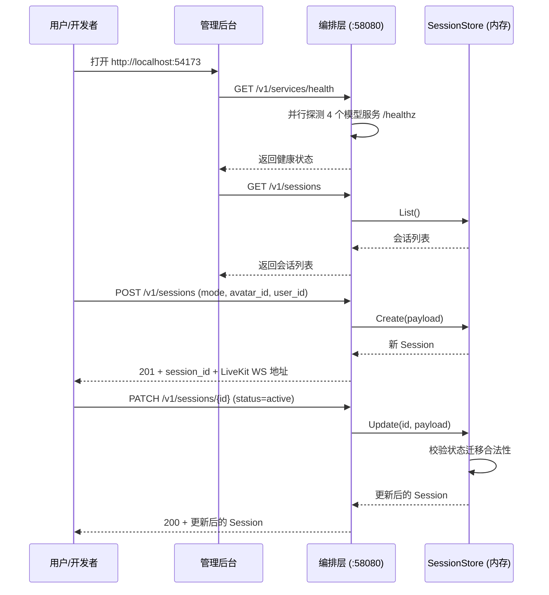
```mermaid
sequenceDiagram
    participant 用户 as 用户/开发者
    participant Admin as 管理后台
    participant Orch as 编排层 (:58080)
    participant Store as SessionStore (内存)

    用户->>Admin: 打开 http://localhost:54173
    Admin->>Orch: GET /v1/services/health
    Orch->>Orch: 并行探测 4 个模型服务 /healthz
    Orch-->>Admin: 返回健康状态
    Admin->>Orch: GET /v1/sessions
    Orch->>Store: List()
    Store-->>Orch: 会话列表
    Orch-->>Admin: 返回会话列表

    用户->>Orch: POST /v1/sessions (mode, avatar_id, user_id)
    Orch->>Store: Create(payload)
    Store-->>Orch: 新 Session
    Orch-->>用户: 201 + session_id + LiveKit WS 地址

    用户->>Orch: PATCH /v1/sessions/{id} (status=active)
    Orch->>Store: Update(id, payload)
    Store->>Store: 校验状态迁移合法性
    Store-->>Orch: 更新后的 Session
    Orch-->>用户: 200 + 更新后的 Session
```

---

## 6. 部署拓扑

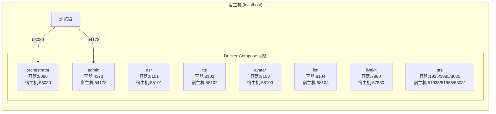
```mermaid
flowchart TB
    subgraph 宿主机["宿主机 (localhost)"]
        direction TB
        subgraph DockerCompose["Docker Compose 网络"]
            direction LR
            ORCH_C["orchestrator<br/>容器:8080<br/>宿主机:58080"]
            ASR_C["asr<br/>容器:8101<br/>宿主机:58101"]
            TTS_C["tts<br/>容器:8102<br/>宿主机:58102"]
            AVATAR_C["avatar<br/>容器:8103<br/>宿主机:58103"]
            LLM_C["llm<br/>容器:8104<br/>宿主机:58104"]
            ADMIN_C["admin<br/>容器:4173<br/>宿主机:54173"]
            LK_C["livekit<br/>容器:7880<br/>宿主机:57880"]
            SRS_C["srs<br/>容器:1935/1985/8080<br/>宿主机:51935/51985/58081"]
        end

        BROWSER["浏览器"]
        BROWSER -->|"54173"| ADMIN_C
        BROWSER -->|"58080"| ORCH_C
    end
```

所有服务通过 Docker Compose 的服务名互相发现（如 `http://avastack-asr:8101`），宿主机通过映射端口访问。

---

## 7. 初始化流程

### 7.1 Go 编排层启动流程

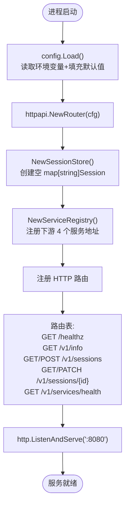
```mermaid
flowchart TB
    START([进程启动]) --> LOAD_CONFIG["config.Load()<br/>读取环境变量+填充默认值"]
    LOAD_CONFIG --> NEW_ROUTER["httpapi.NewRouter(cfg)"]
    NEW_ROUTER --> CREATE_STORE["NewSessionStore()<br/>创建空 map[string]Session"]
    CREATE_STORE --> CREATE_REGISTRY["NewServiceRegistry()<br/>注册下游 4 个服务地址"]
    CREATE_REGISTRY --> REGISTER_ROUTES["注册 HTTP 路由"]
    REGISTER_ROUTES --> ROUTES_LIST["路由表:<br/>GET /healthz<br/>GET /v1/info<br/>GET/POST /v1/sessions<br/>GET/PATCH /v1/sessions/{id}<br/>GET /v1/services/health"]
    ROUTES_LIST --> LISTEN["http.ListenAndServe(':8080')"]
    LISTEN --> RUNNING([服务就绪])
```

### 7.2 Python 模型服务启动流程

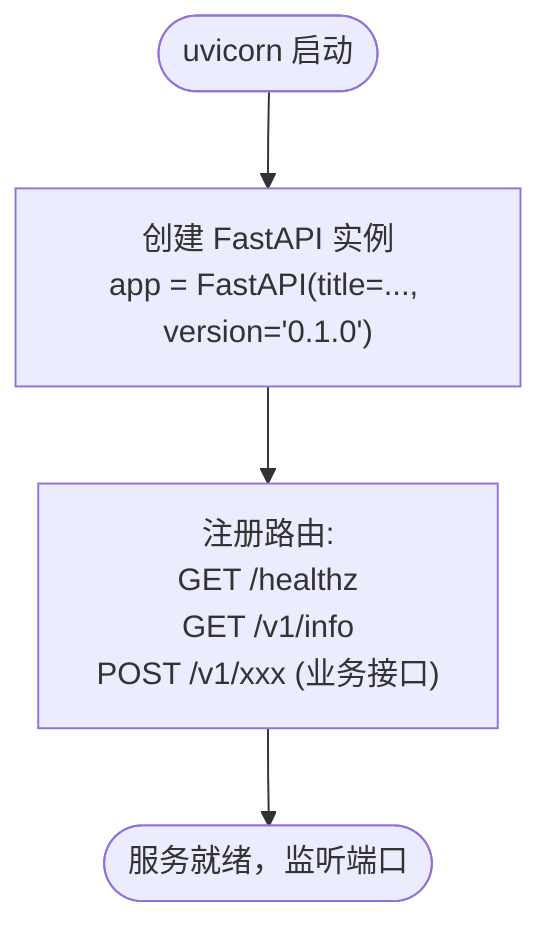
```mermaid
flowchart TB
    START([uvicorn 启动]) --> CREATE_APP["创建 FastAPI 实例<br/>app = FastAPI(title=..., version='0.1.0')"]
    CREATE_APP --> REGISTER["注册路由:<br/>GET /healthz<br/>GET /v1/info<br/>POST /v1/xxx (业务接口)"]
    REGISTER --> READY([服务就绪，监听端口])
```

### 7.3 Admin 前端启动流程

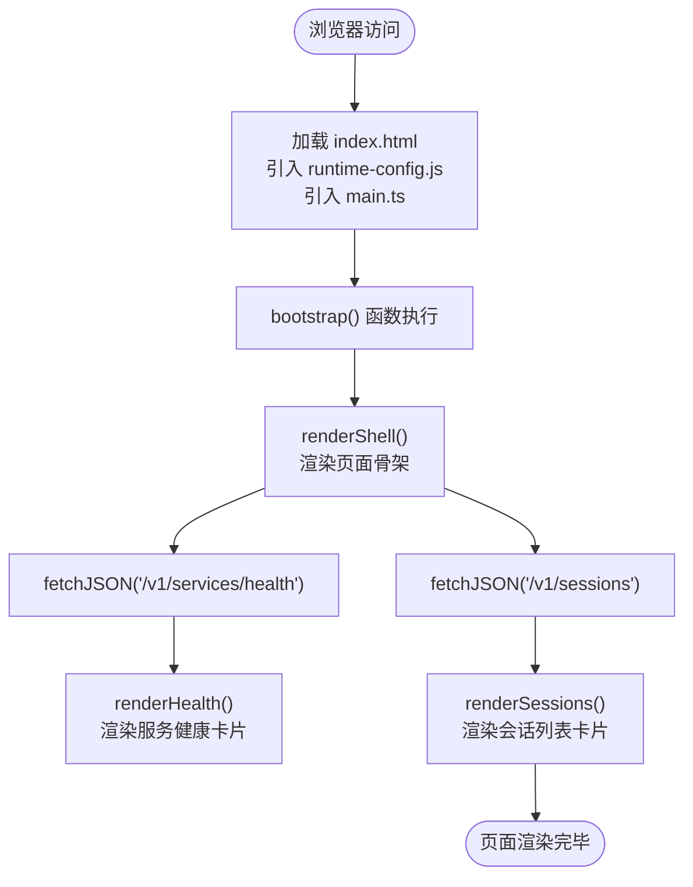
```mermaid
flowchart TB
    START([浏览器访问]) --> LOAD_HTML["加载 index.html<br/>引入 runtime-config.js<br/>引入 main.ts"]
    LOAD_HTML --> BOOTSTRAP["bootstrap() 函数执行"]
    BOOTSTRAP --> RENDER["renderShell()<br/>渲染页面骨架"]
    RENDER --> FETCH_HEALTH["fetchJSON('/v1/services/health')"]
    FETCH_HEALTH --> RENDER_HEALTH["renderHealth()<br/>渲染服务健康卡片"]
    RENDER --> FETCH_SESSIONS["fetchJSON('/v1/sessions')"]
    FETCH_SESSIONS --> RENDER_SESSIONS["renderSessions()<br/>渲染会话列表卡片"]
    RENDER_SESSIONS --> READY([页面渲染完毕])
```

---

## 8. 核心业务流程

### 8.1 会话创建流程

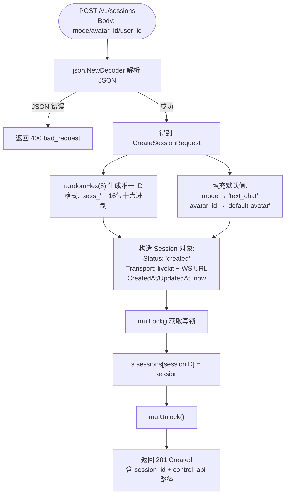
```mermaid
flowchart TB
    REQ([POST /v1/sessions<br/>Body: mode/avatar_id/user_id]) --> PARSE["json.NewDecoder 解析 JSON"]
    PARSE -->|JSON 错误| ERR400["返回 400 bad_request"]
    PARSE -->|成功| DECODE["得到 CreateSessionRequest"]

    DECODE --> GENID["randomHex(8) 生成唯一 ID<br/>格式: 'sess_' + 16位十六进制"]
    DECODE --> DEFAULTS["填充默认值:<br/>mode → 'text_chat'<br/>avatar_id → 'default-avatar'"]

    GENID --> CONSTRUCT["构造 Session 对象:<br/>Status: 'created'<br/>Transport: livekit + WS URL<br/>CreatedAt/UpdatedAt: now"]
    DEFAULTS --> CONSTRUCT

    CONSTRUCT --> LOCK["mu.Lock() 获取写锁"]
    LOCK --> STORE["s.sessions[sessionID] = session"]
    STORE --> UNLOCK["mu.Unlock()"]
    UNLOCK --> RESP["返回 201 Created<br/>含 session_id + control_api 路径"]
```

### 8.2 会话状态流转（状态机）

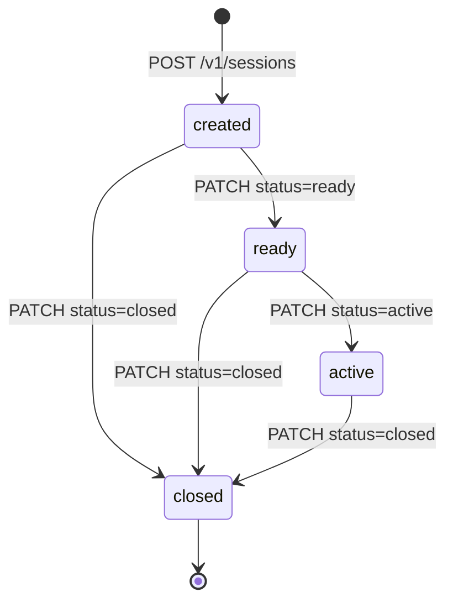
```mermaid
stateDiagram-v2
    [*] --> created : POST /v1/sessions
    created --> ready : PATCH status=ready
    created --> closed : PATCH status=closed
    ready --> active : PATCH status=active
    ready --> closed : PATCH status=closed
    active --> closed : PATCH status=closed
    closed --> [*]
```

**状态机实现**（`controlplane/status.go`）：

| 当前状态 | 允许迁移到 |
|----------|-----------|
| `created` | `ready`, `closed` |
| `ready` | `active`, `closed` |
| `active` | `closed` |
| `closed` | 无（终态） |

**特殊规则**：同状态迁移（如 `created → created`）始终允许，视为幂等操作。

### 8.3 服务健康聚合流程

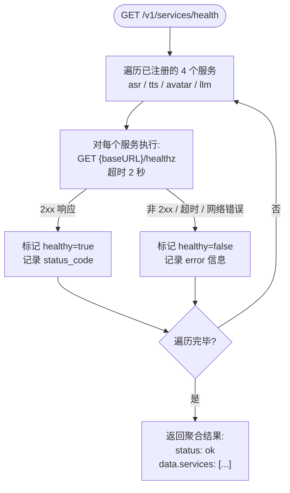
```mermaid
flowchart TB
    REQ([GET /v1/services/health]) --> LOOP["遍历已注册的 4 个服务<br/>asr / tts / avatar / llm"]
    LOOP --> CHECK["对每个服务执行:<br/>GET {baseURL}/healthz<br/>超时 2 秒"]

    CHECK -->|"2xx 响应"| HEALTHY["标记 healthy=true<br/>记录 status_code"]
    CHECK -->|"非 2xx / 超时 / 网络错误"| UNHEALTHY["标记 healthy=false<br/>记录 error 信息"]

    HEALTHY --> NEXT{遍历完毕?}
    UNHEALTHY --> NEXT
    NEXT -->|否| LOOP
    NEXT -->|是| RESP["返回聚合结果:<br/>status: ok<br/>data.services: [...]"]
```

**关键设计点**：
- 使用 `context.Context` 传递请求上下文，支持上游取消
- 超时设定为 2 秒，防止下游服务阻塞导致编排层雪崩
- 健康检查结果不做缓存，每次请求实时探测

---

## 9. 核心类图

### 9.1 Go 编排层核心结构

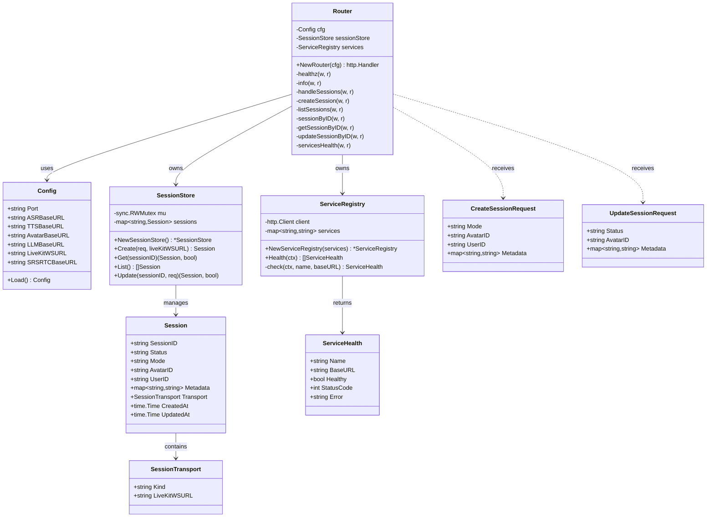
```mermaid
classDiagram
    class Config {
        +string Port
        +string ASRBaseURL
        +string TTSBaseURL
        +string AvatarBaseURL
        +string LLMBaseURL
        +string LiveKitWSURL
        +string SRSRTCBaseURL
        +Load() Config
    }

    class Router {
        -Config cfg
        -SessionStore sessionStore
        -ServiceRegistry services
        +NewRouter(cfg) http.Handler
        -healthz(w, r)
        -info(w, r)
        -handleSessions(w, r)
        -createSession(w, r)
        -listSessions(w, r)
        -sessionByID(w, r)
        -getSessionByID(w, r)
        -updateSessionByID(w, r)
        -servicesHealth(w, r)
    }

    class SessionStore {
        -sync.RWMutex mu
        -map~string,Session~ sessions
        +NewSessionStore() *SessionStore
        +Create(req, liveKitWSURL) Session
        +Get(sessionID) (Session, bool)
        +List() []Session
        +Update(sessionID, req) (Session, bool)
    }

    class ServiceRegistry {
        -http.Client client
        -map~string,string~ services
        +NewServiceRegistry(services) *ServiceRegistry
        +Health(ctx) []ServiceHealth
        -check(ctx, name, baseURL) ServiceHealth
    }

    class Session {
        +string SessionID
        +string Status
        +string Mode
        +string AvatarID
        +string UserID
        +map~string,string~ Metadata
        +SessionTransport Transport
        +time.Time CreatedAt
        +time.Time UpdatedAt
    }

    class SessionTransport {
        +string Kind
        +string LiveKitWSURL
    }

    class ServiceHealth {
        +string Name
        +string BaseURL
        +bool Healthy
        +int StatusCode
        +string Error
    }

    class CreateSessionRequest {
        +string Mode
        +string AvatarID
        +string UserID
        +map~string,string~ Metadata
    }

    class UpdateSessionRequest {
        +string Status
        +string AvatarID
        +map~string,string~ Metadata
    }

    Router --> Config : uses
    Router --> SessionStore : owns
    Router --> ServiceRegistry : owns
    SessionStore --> Session : manages
    ServiceRegistry --> ServiceHealth : returns
    Session --> SessionTransport : contains
    Router ..> CreateSessionRequest : receives
    Router ..> UpdateSessionRequest : receives
```

### 9.2 Python 模型服务结构（以 ASR 为例）

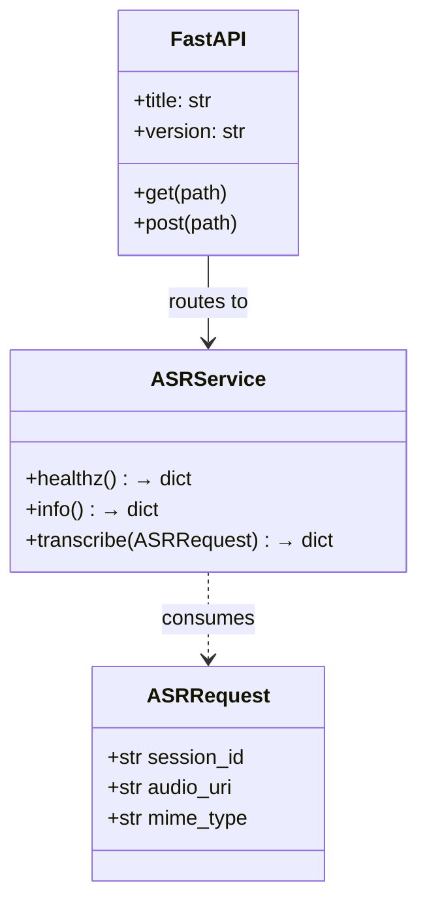
```mermaid
classDiagram
    class FastAPI {
        +title: str
        +version: str
        +get(path)
        +post(path)
    }

    class ASRRequest {
        +str session_id
        +str audio_uri
        +str mime_type
    }

    class ASRService {
        +healthz() → dict
        +info() → dict
        +transcribe(ASRRequest) → dict
    }

    FastAPI --> ASRService : routes to
    ASRService ..> ASRRequest : consumes
```

四个 Python 服务的结构高度同构，差异仅在业务路由：
- ASR: `POST /v1/transcribe`
- TTS: `POST /v1/synthesize` + `GET /v1/voices`
- LLM: `POST /v1/chat`
- Avatar: `POST /v1/render`

---

## 10. 核心时序图

### 10.1 会话创建（POST /v1/sessions）

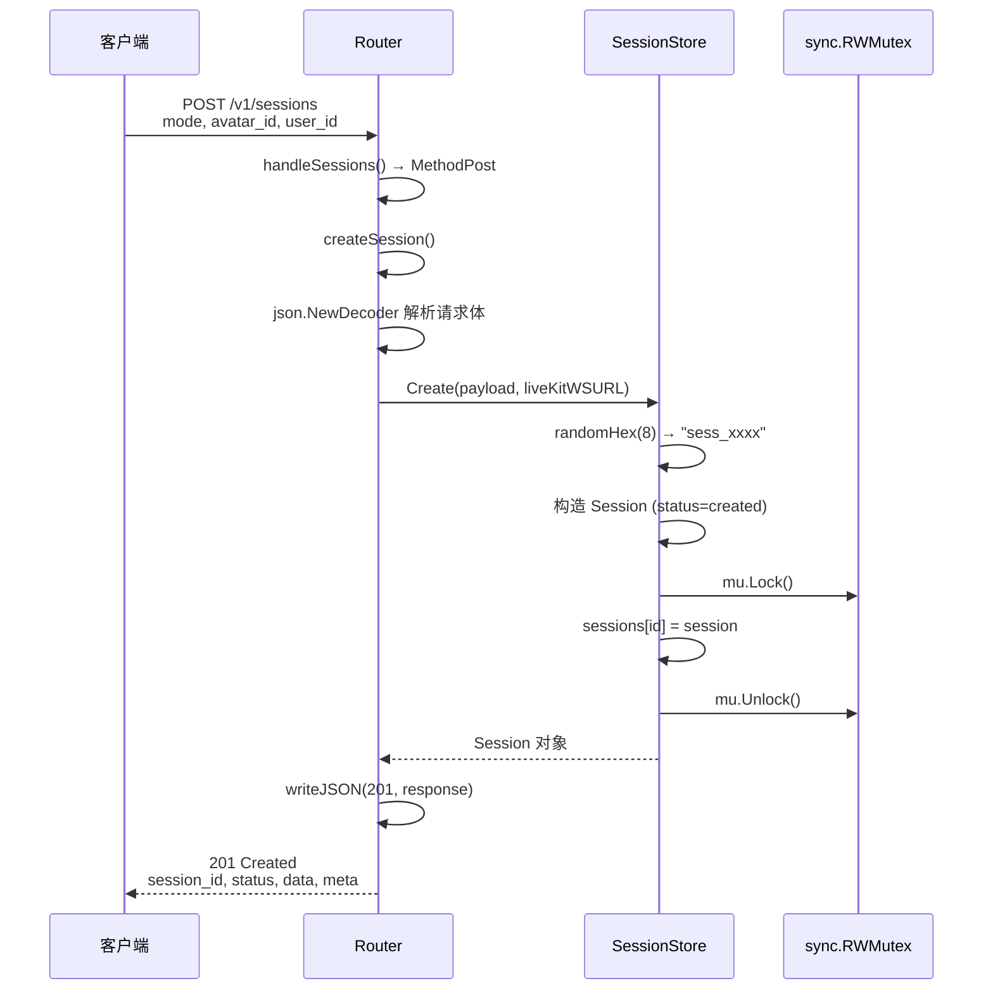
```mermaid
sequenceDiagram
    participant C as 客户端
    participant R as Router
    participant SS as SessionStore
    participant M as sync.RWMutex

    C->>R: POST /v1/sessions<br/>mode, avatar_id, user_id
    R->>R: handleSessions() → MethodPost
    R->>R: createSession()
    R->>R: json.NewDecoder 解析请求体
    R->>SS: Create(payload, liveKitWSURL)
    SS->>SS: randomHex(8) → "sess_xxxx"
    SS->>SS: 构造 Session (status=created)
    SS->>M: mu.Lock()
    SS->>SS: sessions[id] = session
    SS->>M: mu.Unlock()
    SS-->>R: Session 对象
    R->>R: writeJSON(201, response)
    R-->>C: 201 Created<br/>session_id, status, data, meta
```

### 10.2 会话更新与状态校验（PATCH /v1/sessions/{id}）

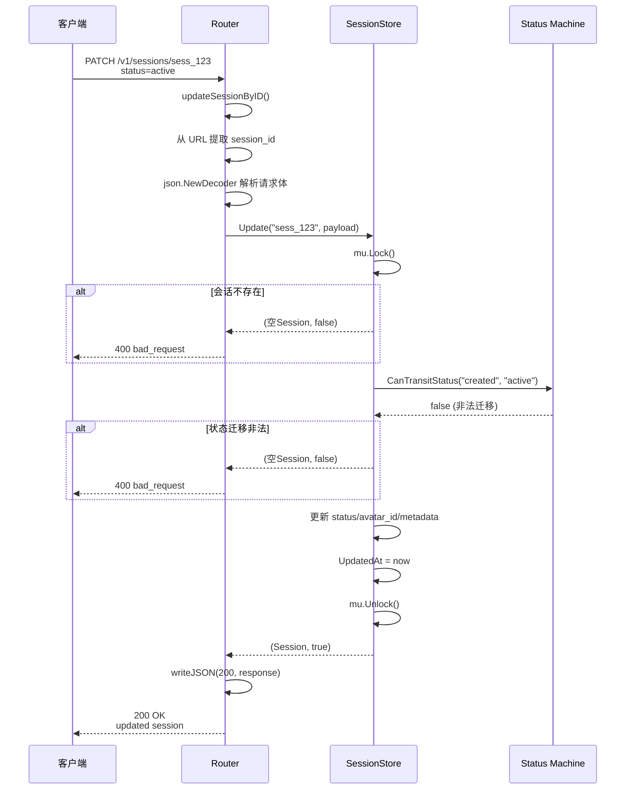
```mermaid
sequenceDiagram
    participant C as 客户端
    participant R as Router
    participant SS as SessionStore
    participant SM as Status Machine

    C->>R: PATCH /v1/sessions/sess_123<br/>status=active
    R->>R: updateSessionByID()
    R->>R: 从 URL 提取 session_id
    R->>R: json.NewDecoder 解析请求体

    R->>SS: Update("sess_123", payload)
    SS->>SS: mu.Lock()

    alt 会话不存在
        SS-->>R: (空Session, false)
        R-->>C: 400 bad_request
    end

    SS->>SM: CanTransitStatus("created", "active")
    SM-->>SS: false (非法迁移)
    alt 状态迁移非法
        SS-->>R: (空Session, false)
        R-->>C: 400 bad_request
    end

    SS->>SS: 更新 status/avatar_id/metadata
    SS->>SS: UpdatedAt = now
    SS->>SS: mu.Unlock()
    SS-->>R: (Session, true)
    R->>R: writeJSON(200, response)
    R-->>C: 200 OK<br/>updated session
```

### 10.3 服务健康聚合（GET /v1/services/health）

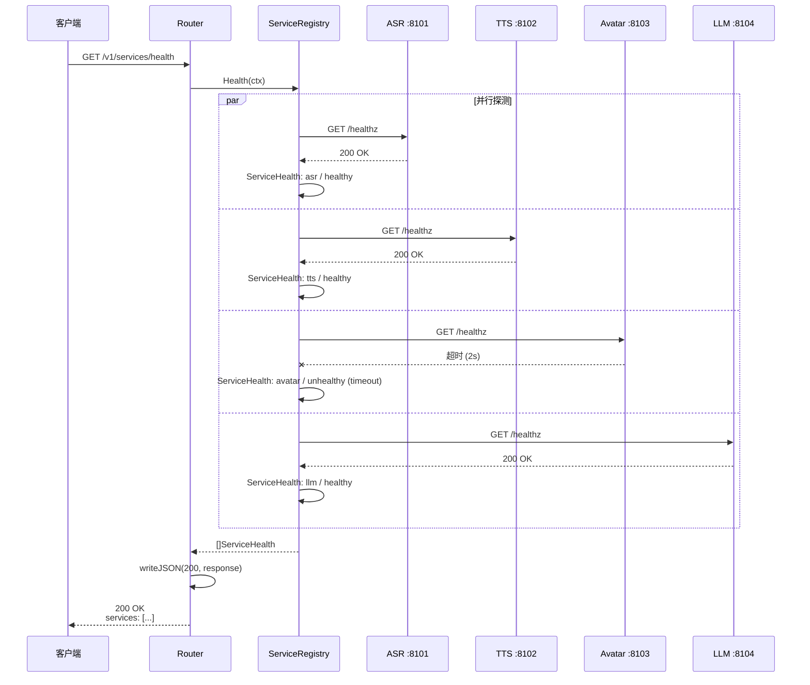
```mermaid
sequenceDiagram
    participant C as 客户端
    participant R as Router
    participant SR as ServiceRegistry
    participant A1 as ASR :8101
    participant A2 as TTS :8102
    participant A3 as Avatar :8103
    participant A4 as LLM :8104

    C->>R: GET /v1/services/health
    R->>SR: Health(ctx)

    par 并行探测
        SR->>A1: GET /healthz
        A1-->>SR: 200 OK
        SR->>SR: ServiceHealth: asr / healthy
    and
        SR->>A2: GET /healthz
        A2-->>SR: 200 OK
        SR->>SR: ServiceHealth: tts / healthy
    and
        SR->>A3: GET /healthz
        A3--xSR: 超时 (2s)
        SR->>SR: ServiceHealth: avatar / unhealthy (timeout)
    and
        SR->>A4: GET /healthz
        A4-->>SR: 200 OK
        SR->>SR: ServiceHealth: llm / healthy
    end

    SR-->>R: []ServiceHealth
    R->>R: writeJSON(200, response)
    R-->>C: 200 OK<br/>services: [...]
```

> **注意**：当前实现的健康探测是串行的（for 循环逐个检查），而非真正并行。`request.Context()` 传递可用作超时控制，但每个 `check` 内部会阻塞至超时或响应。后续可优化为 goroutine 并发探测。

---

## 11. 设计模式

### 11.1 已应用的设计模式

#### ① 外观模式（Facade）

```
编排层 (Router) 作为统一外观，对外隐藏了：
- 下游 4 个模型服务的具体地址
- LiveKit / SRS 的接入细节
- 会话存储的内存实现
- 健康检查的探测逻辑

客户端只需要知道 58080 端口即可访问全部能力。
```

#### ② 仓储模式（Repository）—— 内存实现

```
SessionStore 提供了标准的 CRUD 接口：
- Create() → 创建
- Get()    → 按 ID 查询
- List()   → 列表查询
- Update() → 部分更新

当前用 sync.RWMutex + map 实现，
未来可替换为 Redis / 数据库实现而不影响调用方。
```

#### ③ 服务注册表模式（Service Registry）

```
ServiceRegistry 维护 "服务名 → 地址" 映射，
对外提供统一的 Health() 探测接口。

caller 不需要知道各服务地址如何获取，
也不需要关心健康检查的底层 HTTP 细节。
```

#### ④ 状态机模式（State Machine）

```
会话状态流转由 allowedStatusTransitions 定义：
- 声明式定义合法迁移路径
- 提供 IsValidStatus() 和 CanTransitStatus() 校验
- 业务层只需调用校验，不嵌入状态判断

优势：
- 新增状态只需添加一行 map 定义
- 状态逻辑集中管理，避免散落各处
```

#### ⑤ 适配器模式（Adapter）—— LLM 网关

```
model-llm-python 是 LLM 推理的适配层：
- 对上游（编排层）暴露统一的 POST /v1/chat 接口
- 对下游（vLLM）适配具体的推理请求格式

未来切换推理后端（vLLM → TGI → Ollama）时，
只需修改网关内部适配逻辑，编排层无需感知。
```

#### ⑥ 多阶段构建模式（Builder）—— Docker

```
每个服务的 Dockerfile 使用多阶段构建：
- 阶段 1：构建（编译 / 安装依赖）
- 阶段 2：运行（仅复制产物，镜像更小）

例如 orchestrator-go：
  阶段1: golang:1.22-alpine → go build
  阶段2: alpine:3.20 → 只放二进制文件
```

### 11.2 计划应用的设计模式

| 模式 | 应用场景 | 计划阶段 |
|------|----------|----------|
| **策略模式** | 模型后端切换（如 ASR 可选用 SenseVoice / Whisper） | 阶段 3 |
| **观察者模式** | 会话事件通知（状态变更→ 推送事件） | 阶段 4 |
| **断路器模式** | 下游服务不可用时的熔断保护 | 阶段 2 |
| **门面模式扩展** | Orchestrator 增加鉴权/限流/审计门面 | 阶段 6 |

---

## 12. 潜在架构问题与改进建议

### 12.1 当前已识别的问题

#### 问题 1：无持久化存储（高优先级）

**现象**：会话数据完全存储在内存 (`map[string]Session`) 中，进程重启全部丢失。

**影响**：
- 单点故障即数据丢失
- 无法水平扩展（每个实例有独立的内存数据）
- 无法做历史会话回溯

**建议**：
```
短期（阶段 2）：引入 Redis 或本地 SQLite 作为 SessionStore 的可替换后端
长期（阶段 5）：使用数据库（PostgreSQL）+ 缓存（Redis）双层架构
```

#### 问题 2：健康检查为串行阻塞（中优先级）

**现象**：`ServiceRegistry.Health()` 用 `for` 循环逐个探测，每个超时 2 秒 → 4 个服务全挂时最坏等 8 秒。

**影响**：下游服务故障时会阻塞编排层响应。

**建议**：
```go
// 改为并发探测
func (r *ServiceRegistry) Health(ctx context.Context) []ServiceHealth {
    var wg sync.WaitGroup
    results := make([]ServiceHealth, len(r.services))
    i := 0
    for name, baseURL := range r.services {
        wg.Add(1)
        go func(idx int, n, url string) {
            defer wg.Done()
            results[idx] = r.check(ctx, n, url)
        }(i, name, baseURL)
        i++
    }
    wg.Wait()
    return results
}
```

#### 问题 3：Session ID 生成无碰撞检查（低优先级）

**现象**：`randomHex(8)` 生成 16 字符十六进制字符串，但不检查是否已存在。

**影响**：理论上存在极低概率的 ID 碰撞（但 2^64 空间非常大，实际风险极低）。

**建议**：
```go
func (s *SessionStore) generateUniqueID() string {
    for {
        id := "sess_" + randomHex(8)
        if _, ok := s.Get(id); !ok {
            return id
        }
    }
}
```

#### 问题 4：缺少请求追踪与结构化日志（中优先级）

**现象**：日志仅用 `log.Printf`，没有 `request_id` 关联。

**影响**：多请求并发时难以追踪单个请求的完整调用链。

**建议**：
```
阶段 2：引入 context 传递 request_id，日志统一带上 request_id
阶段 5：接入 OpenTelemetry + 结构化日志（如 zerolog/zap）
阶段 5：接入分布式追踪（Jaeger/Grafana Tempo）
```

#### 问题 5：缺少鉴权与安全控制（高优先级，计划阶段 6）

**现象**：所有接口完全开放，无认证、无授权、无速率限制。

**影响**：无法用于任何生产环境。

**建议**：
```
阶段 6：
- 引入 API Key 或 JWT 认证
- 基于角色的访问控制（RBAC）
- 速率限制（rate limiting）
- 请求体大小限制
```

#### 问题 6：CORS 配置过于宽松（低优先级）

**现象**：`Access-Control-Allow-Origin: *` 允许任意来源跨域访问。

**影响**：当前开发阶段可接受，生产环境需要限制为具体域名。

#### 问题 7：缺少错误重试与断路器（中优先级）

**现象**：健康检查失败即标记 unhealthy，无重试机制；下游服务暂时不可用时会直接传播错误。

**建议**：
```
引入指数退避重试
引入断路器（如 gobreaker / hystrix 模式）
健康检查增加 debounce（连续 N 次失败才标记 unhealthy）
```

#### 问题 8：Python 服务间代码高度重复（低优先级）

**现象**：4 个 Python 服务的 `main.py` 结构几乎完全相同，仅业务路由不同。

**建议**：
```
阶段 3-4：
- 抽取公共基础（shared Python package）
- 定义统一的 ServiceBase 基类
- 统一的 /healthz、/v1/info 抽象
```

#### 问题 9：缺少配置校验（低优先级）

**现象**：`config.Load()` 直接使用默认值，不检查必填环境变量是否设置。

**建议**：增加配置合法性校验，关键参数缺失时启动失败而非使用默认值。

### 12.2 架构健康度评分

| 维度 | 评分 | 说明 |
|------|:----:|------|
| 服务边界清晰度 | ⭐⭐⭐⭐⭐ | 控制面/模型层/基础设施界限分明 |
| 扩展性 | ⭐⭐⭐⭐ | "先 stub 再替换"策略非常适合长期演进 |
| 可观测性 | ⭐⭐ | 当前仅有基本日志和健康聚合，缺少追踪和指标 |
| 安全性 | ⭐ | 无认证/授权/限流（骨架阶段可接受） |
| 可用性 | ⭐⭐ | 单实例 + 内存存储，无容错/故障转移 |
| 代码简洁度 | ⭐⭐⭐⭐⭐ | 极简实现，Go 零依赖，Python 最小化 |
| 文档完整度 | ⭐⭐⭐⭐⭐ | 架构/拆分/路线图/学习手册文档齐全 |

---

## 13. 项目演进路线

### 13.1 演进六阶段

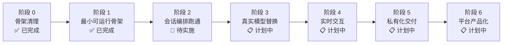
```mermaid
flowchart LR
    P0["阶段 0<br/>骨架清理<br/>✅ 已完成"] --> P1["阶段 1<br/>最小可运行骨架<br/>✅ 已完成"]
    P1 --> P2["阶段 2<br/>会话编排跑通<br/>🔄 待实施"]
    P2 --> P3["阶段 3<br/>真实模型替换<br/>📋 计划中"]
    P3 --> P4["阶段 4<br/>实时交互<br/>📋 计划中"]
    P4 --> P5["阶段 5<br/>私有化交付<br/>📋 计划中"]
    P5 --> P6["阶段 6<br/>平台产品化<br/>📋 计划中"]
```

| 阶段 | 核心任务 | 关键产出 |
|------|----------|----------|
| **阶段 0** | 清理原型代码，建立服务边界 | 骨架仓库、架构文档 |
| **阶段 1** | Compose 启动骨架、最小 API | 可启动开发环境、控制面接口 |
| **阶段 2** | 串联 ASR→LLM→TTS→Avatar→RTC | 完整会话链路（即使 stub） |
| **阶段 3** | LLM→TTS→ASR→Avatar 逐一真实化 | 真实推理能力 |
| **阶段 4** | 引入 LiveKit 实时交互 | 实时双向数字人交互 |
| **阶段 5** | Compose→K8s、监控、日志、追踪 | 标准私有化部署包 |
| **阶段 6** | 鉴权、多租户、配额、A/B 测试 | 平台级产品 |

### 13.2 当前处于的阶段

```
当前：阶段 0 和 1 已完成
- 目录结构重建 ✅
- 服务边界固定 ✅
- Compose 启动骨架 ✅
- 控制面最小 API ✅
- 模型服务 stub ✅
- 管理后台骨架 ✅
- 共享契约定稿 ✅

下一步：阶段 2 —— 会话编排跑通
```

---

## 14. 附录：术语表

| 术语 | 英文 | 说明 |
|------|------|------|
| 编排层 | Orchestrator | 负责会话管理、策略决策、服务路由的中心控制层 |
| 模型服务 | Model Service | 独立部署的 AI 能力接口（ASR/TTS/LLM/Avatar） |
| 控制面 | Control Plane | 编排层对外暴露的管理和业务 API |
| 会话 | Session | 从创建到结束的一次端到端数字人交互 |
| Stub | Stub | 占位实现，返回固定数据而非真实推理结果 |
| 共享契约 | Shared Contract | 所有服务必须遵守的请求/响应格式约定 |
| 状态机 | State Machine | 定义会话状态流转规则（created→ready→active→closed） |
| 健康聚合 | Health Aggregation | 统一探测所有下游服务的健康状态 |
| ASR | Automatic Speech Recognition | 语音识别 |
| TTS | Text to Speech | 语音合成 |
| LLM | Large Language Model | 大语言模型 |
| Avatar | Avatar | 数字人渲染 |
| RTC | Real-Time Communication | 实时音视频通信 |
| LiveKit | LiveKit | 开源 WebRTC 实时通信框架 |
| SRS | Simple Realtime Server | 开源流媒体服务器 |
| vLLM | vLLM | 高性能 LLM 推理引擎 |
| SenseVoice | SenseVoice | 阿里开源语音识别模型 |
| CosyVoice | CosyVoice 2 | 阿里开源语音合成模型 |
| MuseTalk | MuseTalk | 开源数字人面部动画驱动模型 |
| Qwen | Qwen（通义千问） | 阿里开源大语言模型 |

---

> **📖 推荐阅读顺序（面向新人）**：
>
> 1. 先看本文档（你正在读的这份）理解架构全貌
> 2. 再看 [architecture.md](architecture.md) 深入架构设计
> 3. 再看 [service-decomposition.md](service-decomposition.md) 理解每个服务的职责
> 4. 再看 [shared/contracts/README.md](../shared/contracts/README.md) 理解接口契约
> 5. 最后看 [learning-roadmap.md](learning-roadmap.md) 按实操路线动手学习
>
> **🛠 快速启动**：
> ```powershell
> # 复制环境变量
> cp .env.example .env
> # 启动全部服务
> ./start.ps1
> # 验证
> curl http://localhost:58080/healthz
> curl http://localhost:58080/v1/info
> ```
