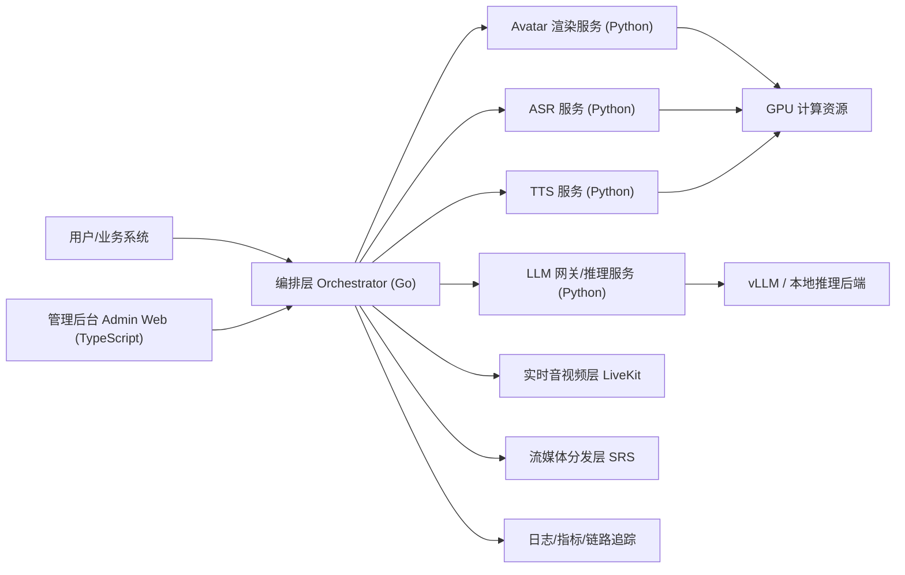

下面是把我们前面讨论过的技术路线，整理成一份可单独立项的完整演进路线。按你的目标来定基线：

- 长期可私有化部署
- 尽量开源可控
- 不是一次性拼装 demo，而是能逐步演进成产品
- 先不优先考虑国产 GPU，但后续要留出替换空间
- 当前阶段以“先跑通一套完整链路，再逐步替换真实能力”为主

**一、总体目标**
先做成一个“服务边界清晰、可本地启动、可容器化部署、后续可上 Kubernetes”的数字人平台骨架，再逐步把 ASR、TTS、LLM、Avatar、RTC、控制台这些能力从 stub 替换成真实实现。

最终目标不是一个大单体，而是一套分层清晰的平台：

1. 编排控制层
2. 模型能力层
3. 实时音视频层
4. 管理与运维层
5. 部署与观测层

---

**二、最终建议的技术基线**

**1. 开发语言**
建议采用“分层分语言”而不是全栈一种语言。

- `Go`
  - 用于编排层、控制面 API、会话状态机、服务聚合、鉴权、任务调度
  - 原因：部署轻、并发稳、二进制交付简单、长期维护成本低
- `Python`
  - 用于模型服务：ASR / TTS / LLM Gateway / Avatar
  - 原因：模型生态基本都在 Python，接开源推理框架最省成本
- `TypeScript`
  - 用于管理后台、运维台、可视化配置界面
  - 原因：前端生态成熟，后续做运维控制台和标注/配置台方便

不建议：
- 全部用 Python：模型方便，但控制层长期会变重
- 全部用 Rust：性能好，但模型生态和交付效率不合适当前阶段
- 全部用 Go：模型层会很难受
- 全部用 TypeScript：模型侧不现实

结论：
- `Go + Python + TypeScript` 是最稳的长期组合

---

**三、平台总体架构**



---

**四、服务拆分建议**

**1. 核心控制层**
- `orchestrator-go`
  - 唯一对外控制面
  - 管会话、路由、状态机、任务编排、服务健康聚合
  - 后续可扩展鉴权、配额、租户、审计

**2. 模型能力层**
- `model-asr-python`
  - 语音转文字
  - 初期可先 stub，后续接 FunASR / Whisper / 商业 ASR
- `model-tts-python`
  - 文本转语音
  - 初期 stub，后续接 CosyVoice / FishSpeech / EdgeTTS / 商业 TTS
- `model-llm-python`
  - LLM 网关层，不直接把业务绑死在某个模型推理框架上
  - 后续接 vLLM、Transformers、商业 API
- `model-avatar-python`
  - 数字人视频驱动、口型、表情、视频合成
  - 初期 stub，后续接 Wav2Lip / MuseTalk / 其他自研链路

**3. 实时音视频层**
- `LiveKit`
  - 主 RTC 层
  - 适合互动型数字人、双向音视频、房间管理
- `SRS`
  - 作为 RTMP/HLS/转推分发补充
  - 更适合直播/分发/兼容传统流媒体链路

**4. 管理与运维层**
- `admin-web`
  - 管理后台
  - 配置模型路由、查看服务健康、创建会话、调试调用链
  - 后续增加 Prompt 管理、角色配置、租户配置、运行审计

**5. 共享契约层**
- `shared/contracts`
  - 所有服务的 API 契约、错误格式、会话模型、状态流转
  - 先文档化，后续可升级成 OpenAPI / protobuf

---

**五、推荐的开源/商用选型路线**

**1. RTC / 实时通信**
首选：
- `LiveKit`
原因：
- 开源、私有化友好、生态成熟、二次开发成本低

备选：
- `mediasoup`
- `Janus`
- `Pion 自研`

结论：
- 先 `LiveKit`
- 直播分发补 `SRS`

**2. LLM 推理**
首选：
- `vLLM`
原因：
- 当前开源私有化推理里，工程可用性和吞吐都比较好

备选：
- `Transformers + Text Generation Inference`
- `Ollama`
- 商业 API 网关

结论：
- 先做 `LLM Gateway`
- 后面默认接 `vLLM`

**3. ASR**
首选路线：
- 接口先抽象
- 初期优先兼容 `FunASR / Whisper`

备选：
- 商业 ASR 作为 fallback

结论：
- 不要在主流程绑死某一家
- 做成统一 `ASR Provider` 接口

**4. TTS**
首选路线：
- 抽象统一接口
- 本地优先 `CosyVoice / FishSpeech` 方向
- 过渡期可接商业 TTS 或 EdgeTTS 验证流程

**5. Avatar**
首选路线：
- 独立成单独服务，不嵌进 orchestrator
- 初期先 stub 接口 + 静态占位输出
- 中期接 `Wav2Lip / MuseTalk` 这类开源方案
- 长期再做更稳定的渲染链路

**6. 容器运行时**
开发机首选：
- `Rancher Desktop`
原因：
- 免费开源
- 避免 Docker Desktop 商业限制
- 对 `docker compose` 兼容较友好

备选：
- `Docker Desktop`
- `WSL2 + Docker Engine`

---

**六、为什么这样分层**
核心原则是“把容易变的部分隔离出去”。

最容易变化的是：
- 模型
- GPU/推理框架
- RTC/流媒体实现细节
- 商业/开源服务供应商

最不应该频繁变化的是：
- 会话模型
- 编排层 API
- 平台管理入口
- 服务契约

所以应该：
- 把模型服务做成可替换插件位
- 把 orchestrator 做成稳定控制面
- 把 infra 做成部署层，不侵入业务逻辑

---

**七、完整技术演进路线**

**阶段 0：工程原型清理期**
目标：
- 从“拼起来能看”变成“服务边界明确”

工作：
- 清掉旧原型耦合代码
- 重建目录结构
- 固定服务边界
- 输出架构文档、服务拆分文档、共享契约文档

产出：
- 新仓库骨架
- Compose 启动骨架
- Orchestrator 基础 API
- 模型服务 stub
- Admin Web 骨架

---

**阶段 1：最小可运行骨架期**
目标：
- 一条命令能拉起整套开发骨架

工作：
- 完成 `start.ps1`
- 支持容器运行时检测、安装提示、自动启动
- `compose up --build` 可拉起基础服务
- 各服务提供 `/healthz`
- orchestrator 提供：
  - 服务信息
  - 服务健康聚合
  - 会话创建/查询/更新

产出：
- 可启动的本地开发环境
- 最小控制面打通

---

**阶段 2：会话编排跑通期**
目标：
- 让“数字人一次请求链路”走通

工作：
- 定义会话状态机
  - created
  - preparing
  - running
  - paused
  - stopped
  - failed
- orchestrator 串联：
  - ASR
  - LLM
  - TTS
  - Avatar
  - RTC
- 管理台增加会话调试页
- 增加结构化日志和请求追踪 ID

产出：
- 从请求进入到结果输出的完整主链路
- 即使底层还是 stub，也能验证平台设计

---

**阶段 3：真实模型逐步替换期**
目标：
- 从 stub 切到真实能力

顺序建议：
1. LLM 先真实化
   - 接 `vLLM`
   - 做模型路由和超时控制
2. TTS 真实化
   - 接本地或云端 TTS
3. ASR 真实化
   - 接本地开源 ASR
4. Avatar 真实化
   - 先静态图驱动
   - 再视频驱动

原因：
- LLM/TTS 的产品价值和调试收益最高
- Avatar 最复杂，应该最后替换

---

**阶段 4：实时交互期**
目标：
- 把“离线调用链”升级成“实时交互数字人”

工作：
- 引入 `LiveKit`
- 支持音频输入、TTS 输出、Avatar 输出的实时串联
- 如果需要直播/推流分发，再挂 `SRS`
- 做 RTC 会话与业务会话的映射

产出：
- 实时双向交互能力
- 房间/会话/媒体流统一模型

---

**阶段 5：私有化交付期**
目标：
- 真正具备企业内部部署能力

工作：
- 从 `compose` 演进到 `Kubernetes`
- 拆配置：
  - 环境配置
  - 模型路由配置
  - 资源配置
  - 租户配置
- 加：
  - Prometheus
  - Loki / ELK
  - OpenTelemetry
  - Grafana
- 完成镜像版本化、配置模板化、部署手册

产出：
- 标准私有化部署包
- 可运维、可观测、可升级

---

**阶段 6：平台产品化期**
目标：
- 从“技术系统”变成“可运营平台”

工作：
- 鉴权与 RBAC
- 多租户
- Prompt/角色/音色/Avatar 模板管理
- 模型供应商路由策略
- 审计与费用统计
- 配额与限流
- A/B 测试和灰度发布

产出：
- 面向组织使用的平台级产品

---

**八、目录级建议**
如果你要把这个路线独立成新项目，建议一开始就按下面拆：

```text
xavatar-platform/
  docs/
  deploy/
    compose/
    k8s/
  services/
    orchestrator-go/
    model-asr-python/
    model-tts-python/
    model-llm-python/
    model-avatar-python/
    admin-web/
  shared/
    contracts/
  tools/
    scripts/
  tests/
```

比“把所有东西放一个 app 里”更适合长期演进。

---

**九、国产 GPU 暂不优先时，架构上怎么预留**
虽然现在不优先做，但最好现在就留扩展点：

1. 模型服务和推理后端解耦
   - `model-llm-python` 不直接绑定某个 CUDA 实现
2. Avatar/ASR/TTS 服务都通过 provider 适配层接模型
3. orchestrator 不感知 GPU 厂商
4. 部署层单独抽象推理资源配置

这样以后如果切国产 GPU，主要改的是：
- 推理服务镜像
- provider 适配层
- 资源调度配置

而不是重写平台主干。

---

**十、当前最推荐的落地顺序**
如果你现在要重新开一个正式项目，我建议你按这个顺序做：

1. 新建独立仓库
2. 先落目录结构和服务边界
3. 先做 `orchestrator-go + admin-web + 4 个 model stub`
4. 用 `compose` 跑通一条完整会话链
5. 再接 `vLLM`
6. 再接 `TTS`
7. 再接 `ASR`
8. 最后接 `Avatar`
9. 再上 `LiveKit`
10. 最后做 Kubernetes 和平台化能力

这是最稳、返工最少的路线。

---

**十一、最后的明确结论**
如果把前面所有讨论压缩成一句话，最终路线就是：

- 用 `Go` 做平台编排层
- 用 `Python` 做模型能力层
- 用 `TypeScript` 做后台
- 用 `LiveKit + SRS` 做实时媒体层
- 用 `vLLM` 做 LLM 私有化推理入口
- 用 `Compose -> Kubernetes` 做部署演进
- 用“先 stub、再逐个替换真实能力”的方式推进
- 开发机容器运行时优先 `Rancher Desktop`

如果你要，我下一步可以直接把这份内容整理成一份正式的《技术路线与演进规划》Markdown 文档模板，适合你复制到新项目里当 `docs/roadmap.md`。